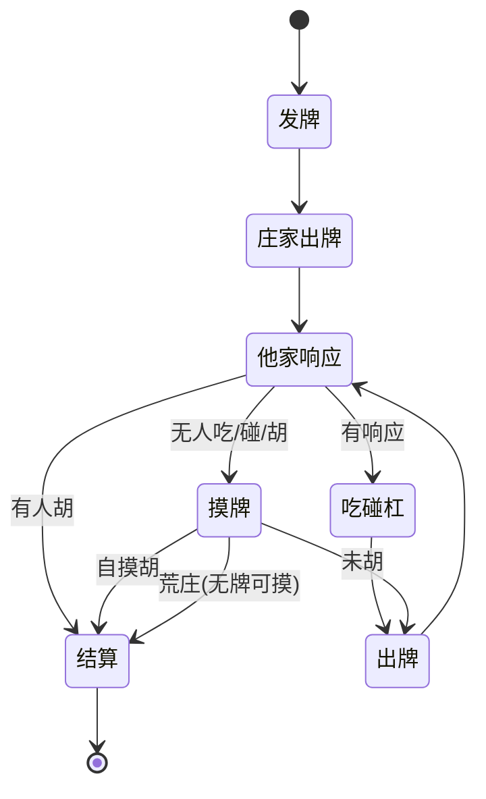

# 00 · 产品总览（全局）

> **模块**：产品定位 / 目标范围 / 角色场景 / 关键流程 / 规则依赖 / 非功能需求 / 风险 / 开放问题（跨模块全局内容）。
> **职责**：产品「做什么 / 怎么做」的全局基线；各功能模块需求见 [PRD 索引](./README.md) 的 01–08。
> **关联**：业务基线 [`../0-业务规则/AC麻将游戏规则说明书.md`](../0-业务规则/AC麻将游戏规则说明书.md)｜技术方案 [`../3-技术文档/README.md`](../3-技术文档/README.md)｜视觉稿 [`../2-效果图/HTML格式高保真原型/`](../2-效果图/HTML格式高保真原型/)｜排期 [`../5-backlog/开发计划-路线图.md`](../5-backlog/开发计划-路线图.md)

---

## 1. 产品概述

### 1.1 背景与定位

- 将一套**高度定制的俱乐部竞赛麻将规则（A&C 规则，17 张 / 5 副 / 台数制）**搬上微信，做成一款**真人联机对战**的麻将小游戏。
- **对局模式**：**房间制**——房主创建房间 → 邀请好友加入 → 满 4 人开始 → 连续对局、按台数结算虚拟积分。
- **计分**：**游戏内虚拟积分**（1 台 = 20 积分），**不对应真实货币、不可兑换 / 提现**。

### 1.2 目标用户

| 用户 | 描述 | 诉求 |
|---|---|---|
| 俱乐部成员 | 熟悉 A&C 规则的线下牌友 | 线上也能按同一套规则开局、算分 |
| 房主 / 组织者 | 组局者 | 快速开房、邀请好友、控制局数 |
| 普通玩家 | 被邀请入局者 | 一键进房、流畅对战、清晰算分 |

### 1.3 核心价值 / 亮点

1. **忠实还原 A&C 规则**：17 张 / 5 副、~50 番种、台数叠加、子 / 连庄结算，全部按业务基线实现。
2. **服务端权威算分**：胡牌判定与台数计算全在后端，杜绝客户端作弊与算分争议。
3. **房间制轻社交**：微信分享一键入局，无需匹配等待。
4. **算分透明**：每局结算展示台数明细（哪些番种、各多少台），帮助玩家理解与复盘。

### 1.4 平台与技术形态

- **平台**：微信小游戏（canvas/WebGL 渲染，`game.js` / `game.json`，`wx.*` API）。
- **客户端引擎**：Cocos Creator（跨平台核心 + 微信/Web 适配层，详见 [`../3-技术文档/AC麻将-联机架构方案.md`](../3-技术文档/AC麻将-联机架构方案.md)）。
- **联机**：后端房间服务 + 实时通信（WebSocket），**服务端权威**。

---

## 2. 目标与范围

### 2.1 本期目标（MVP）

- 微信授权登录、创建 / 加入房间、满 4 人开始。
- 完整单局对局：发牌 → 摸打 → 吃 / 碰 / 杠 / 胡 → 台数计算 → 积分结算 → 下一局。
- 服务端权威的**胡牌判定 + 台数计算 + 结算引擎**（严格遵循业务基线）。
- 诈胡拦截（<6 台不可胡）、一炮多响、荒庄、连庄 / 换庄。
- 断线重连 + 超时托管。
- 房间内积分累计与局末 / 散场战绩展示。

### 2.2 非目标（明确不做）

- **赛季 / 月度排名 / 颁奖 / 奖杯**（已砍，D-03）。
- 真实货币、积分兑换 / 提现、任何赌博性质功能。
- 全局匹配 / 陌生人随机开局（仅房间制）。
- 账号段位天梯、全服排行榜。
- 单机 AI 对战（MVP 不做；是否加练习模式见开放问题 Q1）。
- 观战、直播、聊天室等社交扩展（本期不做）。

---

## 3. 用户角色与核心场景

### 3.1 角色

| 角色 | 说明 |
|---|---|
| 房主 | 创建房间、设定局数上限、人满后开始游戏；同时也是玩家之一 |
| 玩家 | 加入房间、参与对局 |
| 托管玩家 | 断线超时后由系统代打（自动摸打，不主动吃 / 碰 / 杠 / 胡） |

### 3.2 核心场景剧本

> **场景 A：组局**　老张（房主）点「创建房间」，选择「8 局」，生成房间号 `828666` 并分享到微信群。老李、老王、老陈点分享进入房间坐下。满 4 人后老张点「开始」，进入牌桌。

> **场景 B：对局与结算**　系统发牌（庄家 17 张、闲家 16 张），庄家先打。玩家轮流摸打，可吃 / 碰 / 杠。老李自摸胡牌，服务端算出「混一色 15 + 碰碰胡 15 + …」共 N 台，其余三家各按结算公式扣分、老李加分。局末弹出**台数明细 + 积分变动**，进入下一局（老李连庄或换庄）。

> **场景 C：散场**　打满 8 局，系统自动散场并展示本房间总战绩（各玩家积分）。房间解散、积分清零。

> **场景 D：断线**　老王中途掉线，座位保留 60 秒；期间显示「离线」。若 60 秒内重连则继续；超时进入托管，系统代其摸打直至其返回或对局结束。

---

## 4. 关键用户流程（跨模块）

### 4.1 房间全流程

```
大厅
 ├─[创建房间]→ 选局数上限 → 房间等待页(房主) → 微信分享
 └─[加入房间]→ 输房间号/点分享 → 房间等待页(玩家)
房间等待页 → 满 4 人 → 房主点「开始」 → 对局(循环 N 局)
 → 达局数上限 / 房主解散 → 散场总战绩 → 房间关闭(积分清零)
```

### 4.2 单局对局状态机



### 4.3 一次「胡」的判定与结算时序（服务端权威）

```
玩家点「胡」 → 客户端发请求 → 服务端校验（17 张牌型成立 + ≥ 6 台）
 → 通过：按台数表 + 必然包含原则算台 → 按结算公式算各家积分变动
 → 广播结果 → 客户端展示台数明细 + 积分变动
 → 失败（<6 台）：拒绝并提示诈胡风险
```

> 对局流程与牌桌交互的**功能需求**见 [04-对局与牌桌.md](./04-对局与牌桌.md)；其**技术实现**见 [`../3-技术文档/AC麻将-对局流程引擎.md`](../3-技术文档/AC麻将-对局流程引擎.md)。

---

## 5. 规则依赖

> 本 PRD 所有玩法与算分均依赖业务基线 [`../0-业务规则/AC麻将游戏规则说明书.md`](../0-业务规则/AC麻将游戏规则说明书.md)，映射如下：

| 产品功能 | 规则说明书章节 |
|---|---|
| 发牌 / 行牌 / 牌墙末尾 | 第 2 章、第 9.4 节 |
| 胡牌判定 / 牌型结构 | 第 4 章 |
| 台数计算 / 番种 | 第 3 / 5 / 6 章 |
| 必然包含去重 | 第 3 章（+ [`../3-技术文档/AC麻将-台数计算规格书.md`](../3-技术文档/AC麻将-台数计算规格书.md) 矩阵） |
| 结算 / 子 / 连庄 / 诈胡 | 第 9 章 |
| 台数门槛 / 最小胡 | 第 2 章、6.12 |

---

## 6. 非功能需求（NFR）

| 编号 | 类别 | 需求 |
|---|---|---|
| NFR-01 | 性能 | 操作 → 广播延迟可控（目标 <200ms）；牌桌渲染流畅；弱网可降级 |
| NFR-02 | 并发 | 支持多房间并发（具体容量见架构方案） |
| NFR-03 | 安全 / 防作弊 | **服务端权威算分与状态**；**不向他家下发暗牌**（防透视）；通信签名 / 加密、防重放 |
| NFR-04 | 合规 | 虚拟积分**不可兑现**；无赌博暗示；需**游戏版号 / 资质**；健康游戏提示；未成年人保护（如需） |
| NFR-05 | 兼容 | 主流 iOS/Android 机型与微信版本；多分辨率适配 |
| NFR-06 | 可用性 | 断线重连、宕机恢复；房间 / 对局状态可持久化 |
| NFR-07 | 可维护 | 规则引擎**表驱动 / 可配置**，番种与包含矩阵可扩展 |
| NFR-08 | 数据 | 关键事件埋点（开局 / 结算 / 掉线，可选）；对局全量持久化用于审计 / 还原 |

---

## 7. 风险与依赖

| 编号 | 风险 | 等级 | 应对 |
|---|---|---|---|
| R1 | **合规 / 版号**：棋牌类需版号与运营资质，周期长、可能阻塞上架 | 🔴 高 | 尽早启动资质；先做不可上架的**内部原型**验证玩法 |
| R2 | **台数引擎复杂度**：~50 番种 + 包含去重 + 听牌型 | 🔴 高 | 规格书 + 包含 / 互斥矩阵 + 充分单测控制 |
| R3 | 联机实时性与作弊 | 🟡 中 | 服务端权威 + 状态同步 + 加密 |
| R4 | 美术资源（牌面 / 桌布 / 动画） | 🟡 中 | 尽早确定风格（见效果图） |
| R5 | 规则歧义残留：规格书阶段可能发现新边界 | 🟡 中 | 回到业务基线补充、追加 D 类决策 |

---

## 8. 开放问题（产品层）

| 编号 | 问题 | 备注 |
|---|---|---|
| Q1 | 是否加**单机练习模式**（无联机也能练规则）？ | 与 MVP 非目标待定 |
| Q2 | **听牌提示 / 可胡台数预览** 是否进 MVP？ | 影响上手难度（FR-辅助） |
| Q3 | 房主掉线的**权限转移**规则细化 | FR-断线-05 |
| Q4 | 是否支持「再来一局 / 换桌」 | 房间生命周期（已实现房内「再来一局」） |
| Q5 | 是否需要**简易表情 / 快捷语**（轻社交） | 本期不做候选 |
| Q6 | 客户端**引擎选型** | 已定 Cocos Creator（见架构方案） |
| Q7 | **美术风格**（写实 / 卡通） | 归效果图 |

---

## 维护记录

| 日期 | 概要 |
|---|---|
| 2026-09-16 | 从旧单文件 `AC麻将小游戏-PRD.md` 拆出全局内容（概述 / 范围 / 角色场景 / 关键流程 / 规则依赖 / NFR / 风险 / 开放问题）；建立相对路径交叉引用；引擎选型、房内「再来一局」等按已开发进展更新表述 |
| 2026-09-16 | PRD 全量拆分完成后回填交叉引用：§4.3 「对局功能需求/技术实现」由「待拆分/待补」占位链接改为真实的 04-对局与牌桌与对局流程引擎相对路径 |
