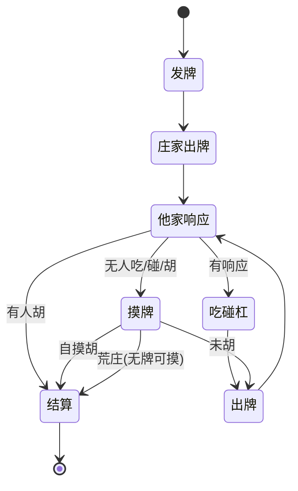

# A&C 麻将小游戏 · 产品需求文档（PRD）

> **版本**：v0.1（草案）　**状态**：编写中
> **关联文档**：
> - 上游：[`docs/0-业务规则/AC麻将游戏规则说明书.md`](../0-业务规则/AC麻将游戏规则说明书.md)（业务基线，D-01~D-24 决策）
> - 下游：《台数计算规格书》、《联机技术架构方案》（`docs/3-技术文档`，待产出）
>
> 本文只定义**产品需求（做什么）**；算法细节见规格书，技术选型见架构方案，视觉稿见 `docs/2-效果图`。

---

## 目录

1. [产品概述](#1-产品概述)
2. [目标与范围](#2-目标与范围)
3. [用户角色与核心场景](#3-用户角色与核心场景)
4. [功能需求（FR）](#4-功能需求fr)
5. [关键用户流程](#5-关键用户流程)
6. [界面与页面需求](#6-界面与页面需求)
7. [规则依赖](#7-规则依赖)
8. [非功能需求（NFR）](#8-非功能需求nfr)
9. [版本规划与里程碑](#9-版本规划与里程碑)
10. [风险与依赖](#10-风险与依赖)
11. [开放问题（产品层）](#11-开放问题产品层)

---

## 1. 产品概述

### 1.1 背景与定位

- 将一套**高度定制的俱乐部竞赛麻将规则（A&C 规则，17 张 / 5 副 / 台数制）** 搬上微信，做成一款**真人联机对战**的麻将小游戏。
- **对局模式**：**房间制**——房主创建房间 → 邀请好友加入 → 满 4 人开始 → 连续对局、按台数结算虚拟积分。
- **计分**：**游戏内虚拟积分**（1 台 = 20 积分），**不对应真实货币、不可兑换/提现**。

### 1.2 目标用户

| 用户 | 描述 | 诉求 |
|---|---|---|
| 俱乐部成员 | 熟悉 A&C 规则的线下牌友 | 线上也能按同一套规则开局、算分 |
| 房主/组织者 | 组局者 | 快速开房、邀请好友、控制局数 |
| 普通玩家 | 被邀请入局者 | 一键进房、流畅对战、清晰算分 |

### 1.3 核心价值 / 亮点

1. **忠实还原 A&C 规则**：17 张/5 副、~50 番种、台数叠加、子/连庄结算，全部按业务基线实现。
2. **服务端权威算分**：胡牌判定与台数计算全在后端，杜绝客户端作弊与算分争议。
3. **房间制轻社交**：微信分享一键入局，无需匹配等待。
4. **算分透明**：每局结算展示台数明细（哪些番种、各多少台），帮助玩家理解与复盘。

### 1.4 平台与技术形态

- **平台**：微信小游戏（canvas/WebGL 渲染，`game.js` / `game.json`，`wx.*` API）。
- **客户端引擎**：待定（Cocos Creator / Laya / 原生 canvas，见架构方案）。
- **联机**：后端房间服务 + 实时通信（WebSocket），**服务端权威**（见架构方案）。

---

## 2. 目标与范围

### 2.1 本期目标（MVP）

- ✅ 微信授权登录、创建/加入房间、满 4 人开始。
- ✅ 完整单局对局：发牌 → 摸打 → 吃/碰/杠/胡 → 台数计算 → 积分结算 → 下一局。
- ✅ 服务端权威的**胡牌判定 + 台数计算 + 结算引擎**（严格遵循业务基线）。
- ✅ 诈胡拦截（<6 台不可胡）、一炮多响、荒庄、连庄/换庄。
- ✅ 断线重连 + 超时托管。
- ✅ 房间内积分累计与局末/散场战绩展示。

### 2.2 非目标（明确不做）

- ❌ **赛季 / 月度排名 / 颁奖 / 奖杯**（已砍，D-03）。
- ❌ 真实货币、积分兑换/提现、任何赌博性质功能。
- ❌ 全局匹配 / 陌生人随机开局（仅房间制）。
- ❌ 账号段位天梯、全服排行榜。
- ❌ 单机 AI 对战（MVP 不做；是否加练习模式见开放问题）。
- ❌ 观战、直播、聊天室等社交扩展（本期不做）。

---

## 3. 用户角色与核心场景

### 3.1 角色

| 角色 | 说明 |
|---|---|
| 房主 | 创建房间、设定局数上限、人满后开始游戏；同时也是玩家之一 |
| 玩家 | 加入房间、参与对局 |
| 托管玩家 | 断线超时后由系统代打（自动摸打，不主动吃/碰/杠/胡） |

### 3.2 核心场景剧本

> **场景 A：组局**
> 老张（房主）点「创建房间」，选择「8 局」，生成房间号 `828666` 并分享到微信群。老李、老王、老陈点分享进入房间坐下。满 4 人后老张点「开始」，进入牌桌。

> **场景 B：对局与结算**
> 系统发牌（庄家 17 张、闲家 16 张），庄家先打。玩家轮流摸打，可吃/碰/杠。老李自摸胡牌，服务端算出「混一色 15 + 碰碰胡 15 + …」共 N 台，其余三家各按结算公式扣分、老李加分。局末弹出**台数明细 + 积分变动**，自动进入下一局（老李连庄或换庄）。

> **场景 C：散场**
> 打满 8 局，系统自动散场并展示本房间总战绩（各玩家积分）。房间解散、积分清零。

> **场景 D：断线**
> 老王中途掉线，座位保留 60 秒；期间显示「离线」。若 60 秒内重连则继续；超时进入托管，系统代其摸打直至其返回或对局结束。

---

## 4. 功能需求（FR）

> 编号规则：`FR-<模块>-<序号>`；优先级 P0=MVP 必需 / P1=重要 / P2=可延后。

### 4.1 登录与身份

| 编号 | 需求 | 优先级 |
|---|---|---|
| FR-登录-01 | 微信授权登录：`wx.login` 获取 code → 后端换 openid 作唯一身份；获取昵称/头像用于展示 | P0 |
| FR-登录-02 | 无账号密码体系；重进自动恢复登录态 | P0 |
| FR-登录-03 | 合规：首次进入展示《用户协议》《隐私政策》与健康游戏提示 | P0 |

### 4.2 大厅 / 入口

| 编号 | 需求 | 优先级 |
|---|---|---|
| FR-大厅-01 | 主界面两个核心入口：**创建房间** / **加入房间** | P0 |
| FR-大厅-02 | 展示玩家昵称头像、版本号、公告位 | P1 |
| FR-大厅-03 | 规则说明入口（内置《游戏规则》可查看，取自业务基线） | P1 |

### 4.3 房间系统

| 编号 | 需求 | 优先级 |
|---|---|---|
| FR-房间-01 | **创建房间**：房主设定**局数上限**（4/8/16 局或不限，D-23）→ 生成 **6 位房间号** + 微信分享卡片 | P0 |
| FR-房间-02 | **加入房间**：输入房间号或点分享卡片进入；仅当房间**未满 4 人且未开始**时可加入 | P0 |
| FR-房间-03 | **等待页**：4 个座位，展示各座位头像/昵称/在线状态；房主位标识 | P0 |
| FR-房间-04 | **开始条件**：**必须满 4 人**（D-22）；房主点「开始」进入对局 | P0 |
| FR-房间-05 | **散场/解散**：达局数上限自动散场；房主可手动解散；散场后**积分清零**（D-03） | P0 |
| FR-房间-06 | **生命周期**：对局中禁止新玩家加入；玩家中途退房按断线/托管处理（见 4.5） | P0 |
| FR-房间-07 | 房间号有效期与回收（散场后号可释放） | P1 |

### 4.4 对局流程

| 编号 | 需求 | 优先级 |
|---|---|---|
| FR-对局-01 | **开局发牌**：144 张牌墙；庄家 17 张 / 闲家 16 张；**庄家先打**（D-08） | P0 |
| FR-对局-02 | **行牌**：摸 1 打 1；轮到自己时可 打牌 / 吃 / 碰 / 杠 / 胡 / 过 | P0 |
| FR-对局-03 | **吃/碰/杠**：吃（上家弃牌成顺）、碰（成刻）、明杠/暗杠/加杠；杠后补摸牌 | P0 |
| FR-对局-04 | **末尾规则**：牌墙剩 ≤8 张时禁吃/碰/碰杠（可摸杠）；最后 4 张死牌不摸 → 荒庄（D-09） | P0 |
| FR-对局-05 | **胡牌判定**：**服务端权威**；胡牌 = 17 张；校验是否 ≥6 台（D-15） | P0 |
| FR-对局-06 | **台数计算**：服务端按「台数表 + 必然包含原则」算台（参规则说明书第 3/5/6 章） | P0 |
| FR-对局-07 | **诈胡拦截**：<6 台的「胡」请求被服务端拒绝；客户端提前置灰/提示，避免误操作 | P0 |
| FR-对局-08 | **一炮多响**：一张弃牌被多家同时胡 → 都成立，点炮方分别赔付（D-20） | P0 |
| FR-对局-09 | **结算**：台数→积分（1 台=20）；点炮=点炮方付、自摸=三家各付；子/连庄公式（D-17/18/19） | P0 |
| FR-对局-10 | **连庄/换庄**：庄胡连庄、闲胡换庄（D-18） | P0 |
| FR-对局-11 | **荒庄结算**：不计分、无人得失、庄家连庄（D-21） | P0 |
| FR-对局-12 | **局末展示**：弹出台数明细（番种构成）+ 各家积分变动 → 进入下一局 | P0 |
| FR-对局-13 | **操作倒计时**：每步限时（如 15 秒），超时自动打牌/过 | P0 |
| FR-对局-14 | **可胡/可碰提示**：轮到玩家时高亮可用操作（吃/碰/杠/胡） | P1 |

### 4.5 断线重连与托管

| 编号 | 需求 | 优先级 |
|---|---|---|
| FR-断线-01 | 掉线后**保留座位 60 秒**（D-24），其余三家可见其「离线」状态 | P0 |
| FR-断线-02 | 60 秒内重连 → 完整恢复对局（手牌/牌河/轮次/积分） | P0 |
| FR-断线-03 | 超时进入**托管**：自动摸打，**不主动吃/碰/杠/胡**（保守策略），直至其返回或本局结束 | P0 |
| FR-断线-04 | 托管期间玩家返回可立即接管 | P0 |
| FR-断线-05 | 房主掉线：房主权限临时转移或暂停开局（待定，见开放问题） | P1 |
| FR-断线-06 | 服务端持久化房间/对局状态，支持重连与宕机恢复 | P0 |

### 4.6 积分与战绩

| 编号 | 需求 | 优先级 |
|---|---|---|
| FR-积分-01 | 房间内积分**初始 0、按局累计**，实时显示在牌桌 | P0 |
| FR-积分-02 | 局末结算展示各家**积分变动 + 当前累计** | P0 |
| FR-积分-03 | 散场展示**总战绩**（各家最终积分、局数回顾） | P0 |
| FR-积分-04 | **无跨房间持久化 / 无赛季 / 无排行**（D-03） | P0 |
| FR-积分-05 | 台数明细可回看（本局番种构成与各自台数） | P1 |

### 4.7 交互辅助

| 编号 | 需求 | 优先级 |
|---|---|---|
| FR-辅助-01 | 手牌**自动理牌**（按花色/点数排序，可手动调整） | P0 |
| FR-辅助-02 | **听牌提示**（可开关；告知听哪几张） | P2 |
| FR-辅助-03 | **可胡台数预览**（点胡前预估，最终以服务端为准） | P2 |

### 4.8 表现（动画/音效）

| 编号 | 需求 | 优先级 |
|---|---|---|
| FR-表现-01 | 发牌/摸牌/打牌/吃碰杠胡 基础动画 | P1 |
| FR-表现-02 | 音效（可静音） | P1 |
| FR-表现-03 | 结算动画（台数飞入 / 积分跳动） | P2 |

---

## 5. 关键用户流程

### 5.1 房间全流程

```
大厅
 ├─[创建房间]→ 选局数上限 → 房间等待页(房主) → 微信分享
 └─[加入房间]→ 输房间号/点分享 → 房间等待页(玩家)
房间等待页 → 满 4 人 → 房主点「开始」 → 对局(循环 N 局)
 → 达局数上限 / 房主解散 → 散场总战绩 → 房间关闭(积分清零)
```

### 5.2 单局对局状态机



### 5.3 一次「胡」的判定与结算时序（服务端权威）

```
玩家点「胡」 → 客户端发请求 → 服务端校验（17 张牌型成立 + ≥ 6 台）
 → 通过：按台数表 + 必然包含原则算台 → 按结算公式算各家积分变动
 → 广播结果 → 客户端展示台数明细 + 积分变动
 → 失败（<6 台）：拒绝并提示诈胡风险
```

---

## 6. 界面与页面需求

> 仅定义**信息架构与关键元素**（做什么）；视觉稿在 `docs/2-效果图`。

### 6.1 页面清单

| 编号 | 页面 | 关键内容 |
|---|---|---|
| P1 | 登录/授权页 | 微信一键登录、协议勾选 |
| P2 | 大厅页 | 创建房间 / 加入房间 两大入口、玩家信息 |
| P3 | 创建房间弹窗 | 局数上限选择（4/8/16/不限） |
| P4 | 加入房间弹窗 | 输入 6 位房间号 |
| P5 | 房间等待页 | 4 座位、分享按钮、房主「开始」 |
| P6 | **牌桌页（核心）** | 见 6.2 |
| P7 | 局末结算弹窗 | 台数明细、各家积分变动 |
| P8 | 散场战绩页 | 总积分、局数回顾 |
| P9 | 规则说明页 | 内置游戏规则（取自业务基线） |
| P10 | 设置 | 音效/静音、退出房间 |

### 6.2 牌桌页（P6）关键元素

- **底部**：自己手牌（点选打牌）、操作按钮（吃/碰/杠/胡/过）、理牌。
- **中央**：牌河（各家弃牌）、**剩余牌墙数**、**庄家标识**、**各家子数**。
- **四家**：头像/昵称/**积分**/在线状态/托管标识、各家亮明的吃/碰/杠。
- **顶部**：房间号、局数（x/N）、菜单（规则/设置/退出）。
- **反馈**：操作倒计时进度条、轮到自己的高亮/提示、可胡/可碰提示。

---

## 7. 规则依赖

> 本 PRD 所有玩法与算分均依赖业务基线，映射如下：

| PRD 功能 | 规则说明书章节 |
|---|---|
| 发牌/行牌/牌墙末尾 | 第 2 章、第 9.4 节 |
| 胡牌判定/牌型结构 | 第 4 章 |
| 台数计算/番种 | 第 3/5/6 章 |
| 必然包含去重 | 第 3 章（+ 规格书矩阵） |
| 结算/子/连庄/诈胡 | 第 9 章 |
| 台数门槛/最小胡 | 第 2 章、6.12 |

---

## 8. 非功能需求（NFR）

| 编号 | 类别 | 需求 |
|---|---|---|
| NFR-01 | 性能 | 操作→广播延迟可控（目标 <200ms）；牌桌渲染流畅；弱网可降级 |
| NFR-02 | 并发 | 支持多房间并发（具体容量见架构方案） |
| NFR-03 | 安全/防作弊 | **服务端权威算分与状态**；**不向他家下发暗牌**（防透视）；通信签名/加密、防重放 |
| NFR-04 | 合规 | 虚拟积分**不可兑现**；无赌博暗示；需**游戏版号/资质**；健康游戏提示；未成年人保护（如需） |
| NFR-05 | 兼容 | 主流 iOS/Android 机型与微信版本；多分辨率适配 |
| NFR-06 | 可用性 | 断线重连、宕机恢复；房间/对局状态可持久化 |
| NFR-07 | 可维护 | 规则引擎**表驱动/可配置**，番种与包含矩阵可扩展 |
| NFR-08 | 数据 | 关键事件埋点（开局/结算/掉线，可选） |

---

## 9. 版本规划与里程碑

| 里程碑 | 目标 | 交付物 |
|---|---|---|
| **M0：规则引擎原型**（建议最先） | 验证**最难**的胡牌判定 + 台数计算 + 结算（纯逻辑、无UI） | 引擎模块 + 单元测试集（覆盖算例/特例） |
| **M1：MVP 联机** | 房间 + 完整对局 + 结算 + 断线托管，可内测 | 可玩版本 |
| **M2：体验与稳定** | 性能优化、动画音效、听牌提示、战绩 | 完善版 |
| **M3：合规上线** | 版号/资质、协议、健康提示、平台审核 | 正式版 |

> **强烈建议先做 M0**：台数引擎是全项目**最大风险与难点**，且可独立于 UI/联机验证，早做早暴露问题。

---

## 10. 风险与依赖

| 编号 | 风险 | 等级 | 应对 |
|---|---|---|---|
| R1 | **合规/版号**：棋牌类需版号与运营资质，周期长、可能阻塞上架 | 🔴 高 | 尽早启动资质；先做不可上架的**内部原型**验证玩法 |
| R2 | **台数引擎复杂度**：~50 番种 + 包含去重 + 听牌型 | 🔴 高 | 规格书 + 包含/互斥矩阵 + 充分单测控制 |
| R3 | 联机实时性与作弊 | 🟡 中 | 服务端权威 + 状态同步 + 加密 |
| R4 | 美术资源（牌面/桌布/动画） | 🟡 中 | 尽早确定风格（见效果图） |
| R5 | 规则歧义残留：规格书阶段可能发现新边界 | 🟡 中 | 回到业务基线补充、追加 D 类决策 |

---

## 11. 开放问题（产品层）

| 编号 | 问题 | 备注 |
|---|---|---|
| Q1 | 是否加**单机练习模式**（无联机也能练规则）？ | 与 MVP 非目标待定 |
| Q2 | **听牌提示 / 可胡台数预览** 是否进 MVP？ | 影响上手难度 |
| Q3 | 房主掉线的**权限转移**规则细化 | FR-断线-05 |
| Q4 | 是否支持「再来一局/换桌」 | 房间生命周期 |
| Q5 | 是否需要**简易表情/快捷语**（轻社交） | 本期不做候选 |
| Q6 | 客户端**引擎选型**（Cocos/Laya/原生） | 归架构方案 |
| Q7 | **美术风格**（写实/卡通） | 归效果图 |

---

> **下一步**：PRD 定稿后，产出《台数计算规格书》（含番种包含/互斥矩阵、胡牌判定算法、台数计算伪代码与测试用例），并建议同步启动 **M0 规则引擎原型**。
