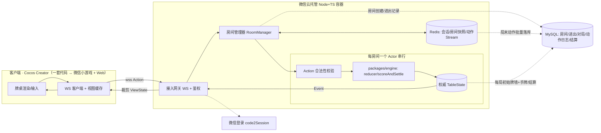
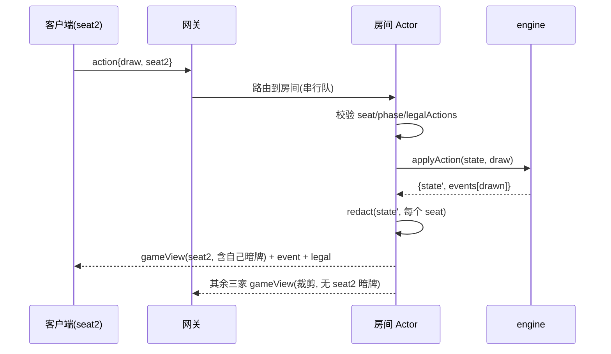

# A&C 麻将 · 联机架构方案

> **版本**：v0.2（数据存储升级：Redis + MySQL · 全量可还原）　**面向**：服务端 + 客户端联调开发
> **上游**：[PRD 索引](../1-prd/README.md)、[台数计算规格书](./AC麻将-台数计算规格书.md)、`packages/engine`（已完成的台数 + 对局流程引擎）
> **核心思想**：**把 `packages/engine` 的 `reducer` 直接作为服务端权威状态机**——客户端只发 `Action`、只收**按座位裁剪**后的 `ViewState`，引擎代码前后端共享、服务端唯一裁决。

---

## 目录

1. [目标与范围](#1-目标与范围)
2. [架构总览](#2-架构总览)
3. [技术选型](#3-技术选型已定)
4. [服务端权威模型](#4-服务端权威模型)
5. [通信协议（WebSocket）](#5-通信协议websocket)
6. [房间服务与生命周期](#6-房间服务与生命周期)
7. [状态同步与视图裁剪](#7-状态同步与视图裁剪防透视)
8. [断线重连与托管](#8-断线重连与托管)
9. [安全与防作弊](#9-安全与防作弊)
10. [微信云托管部署](#10-微信云托管部署)
11. [数据存储](#11-数据存储)
12. [并发与可扩展性](#12-并发与可扩展性)
13. [关键时序](#13-关键时序)
14. [里程碑](#14-里程碑)
15. [风险与开放问题](#15-风险与开放问题)

---

## 1. 目标与范围

- **支撑**：房间制 4 人真人联机对战（PRD 第 4 章），服务端权威的胡牌判定/台数/结算。
- **必须**：实时同步、断线重连、超时托管、防作弊（防透视/防篡改）、微信登录鉴权。
- **跨平台复用（决策1）**：本期微信小游戏，但架构须支撑未来**独立 HTML5 版**（不依赖微信）——平台无关核心 + 平台适配层，最小化微信耦合。
- **不做**：全局匹配、跨房间积分账户、赛季排行（PRD 非目标、D-03/D-32）。**但**每局对局记录全量持久化用于审计/还原（见第 11 章）。

## 2. 架构总览



**分层职责**：
- **客户端**：渲染 + 采集输入 → 发 `Action`；接收**裁剪后的 `ViewState`** 渲染，**从不持有他家暗牌**。
- **接入网关**：WSS 连接、鉴权、心跳、消息路由到房间。
- **房间 Actor**：单房间串行处理 Action（天然免锁），持有权威 `TableState`。
- **引擎**：直接复用 `packages/engine`（`applyAction`/`scoreAndSettle`），**服务端唯一算分**。
- **Redis**：会话/重连、房间实时快照（宕机恢复）、逐动作写缓冲（Stream）、`room→instance` 路由与锁。
- **MySQL**：**权威持久层**——房间创建、进出记录、每局初始牌墙 + 起手手牌、动作日志、结算/积分变动；支撑审计与**真实对局还原**（详见第 11 章）。

## 3. 技术选型（已定）

| 层 | 选型 | 说明 |
|---|---|---|
| 客户端 | **Cocos Creator**（一套代码导出 微信小游戏 + Web/HTML5） | 跨平台复用（决策1）；渲染/输入/音频由引擎抽象 |
| 服务端 | **Node.js + TypeScript + ws** | 与引擎同语言，直接 import `@ac-majong/engine` |
| 实时 | **WebSocket** | 小游戏 **`wx.cloud.connectContainer`**（连云托管、免配域名，返回标准 socketTask） |
| 托管 | **微信云托管**（Docker 容器） | 用户已定；原生支持 WS、免运维、贴合微信生态 |
| 鉴权 | 云托管注入 `x-wx-openid`（主）+ `code2Session`（iOS 高性能+ 兜底） | openid 作身份 |
| 存储 | **Redis + MySQL**（云托管配套/云数据库） | Redis：会话/房间快照/动作缓冲；MySQL：房间/进出/对局/动作日志/结算 **永久持久化**（见第 11 章） |
| 共享 | `packages/engine`（pnpm workspace） | 客户端可选本地预算，服务端权威 |

> ✅ **已核实（A1 消解）**：用**云托管**作后端时**无需配置通讯域名、无需自有备案域名**——客户端用 `wx.cloud.connectContainer`（WebSocket）/ `callContainer`（HTTPS）走微信私有协议直连云托管（官方小游戏网络文档）。需**基础库 ≥ 2.21.1**。

---

## 4. 服务端权威模型

### 4.1 单一权威状态机

- 每个房间持有一份权威 `TableState`（来自 `packages/engine`）。
- 所有变更**只能**通过 `applyAction(state, action) → { state, events }` 发生；服务端是唯一写入方。
- 客户端**不运行权威逻辑**；可选跑同一引擎做**本地预算**（如听牌提示、可胡预览），但**以服务端结果为准**（PRD NFR-03）。

### 4.2 Action 两层

| 层 | Action | 处理方 |
|---|---|---|
| **房间层** | `create/join/leave/ready/start/reconnect` | RoomManager |
| **对局层** | 引擎的 `Action`：`draw/discard/respond/declareWin/kongConcealed/kongAdded` | 房间 Actor → `applyAction` |

### 4.3 一个回合的服务端处理

```
收到对局层 Action
 → 校验：发送者 seat == 当前可行动 seat？phase 匹配？Action ∈ legalActions(state, seat)？
 → 否：回 err（非法操作），不改状态
 → 是：{ state, events } = applyAction(state, action)
       → 持久化快照（异步）
       → 对每个座位生成裁剪 ViewState，分别下发
       → 必要时推进（如 advance 后自动触发下家 draw，或等客户端 draw）
```

> **合法性双重校验**：客户端 `legalActions` 置灰按钮只是 UX；服务端必须再校验一次（防篡改客户端）。

---

## 5. 通信协议（WebSocket）

### 5.1 消息封装

所有消息为 JSON，统一信封：
```jsonc
{ "t": "<类型>", "seq": 123, "room": "828666", "ts": 1699999999, "payload": { } }
```
- `seq`：客户端递增，服务端 `ack` 回带，用于去重/排序（防重放）。

### 5.2 客户端 → 服务端

| t | payload | 说明 |
|---|---|---|
| `auth` | `{ code }` | wx.login 的 code 换会话 |
| `create` | `{ maxRounds }` | 建房，返回房间号 |
| `join` | `{ room }` | 加入房间 |
| `leave` | `{}` | 离房 |
| `start` | `{}` | 房主开始（满 4 人） |
| `action` | `{ action: <引擎Action> }` | 对局动作（draw/discard/respond/…） |
| `ping` | `{}` | 心跳 |

### 5.3 服务端 → 客户端

| t | payload | 说明 |
|---|---|---|
| `authOk` | `{ session, self }` | 鉴权成功 |
| `roomView` | `{ room, seats, you, phase }` | 房间/等待页视图 |
| `gameView` | `{ ViewState }`（裁剪） | 牌桌视图（见第 7 章） |
| `event` | `{ events: GameEvent[] }` | 增量事件（动画/提示用） |
| `legal` | `{ seat, actions }` | 你当前可执行动作 |
| `ack` / `err` | `{ seq, ok, reason? }` | 确认/错误 |
| `pong` | `{}` | 心跳回 |

### 5.4 心跳与断线

- 客户端每 ~10s `ping`；服务端 ~30s 未收到 → 判定掉线（进入托管，第 8 章）。
- 重连：客户端带 `session` 重发 `auth` → 服务端恢复其座位与 `gameView`。

---

## 6. 房间服务与生命周期

### 6.1 RoomManager

- 管理房间表：`roomId → RoomActor`；分配 6 位房间号（**全局唯一、永不复用**：发号对照内存活跃房 + `rooms` 历史表双重查重，BL-016）。
- 创建：房主选局数上限（4/8/16/不限，D-23）→ 生成房间号 + 分享卡片。
- 加入：未满 4 人且未开始可新加入；**已入座成员房间周期内随时重进**（积分保留，BL-016）；已关闭房间拒绝。

### 6.2 RoomActor（单房间串行）

- 持有：权威 `TableState` + `seat → connection` 映射 + 一个**串行任务队列**（同一房间的 Action 逐个处理，天然免锁、免竞态）。
- 生命周期：`waiting`（等人）→ `playing`（对局，可多局）→ `settled`（局末）→ 下一局 / `dissolved`（散场）。
- 散场：达局数上限自动 / 房主手动 → 积分定格（`final_score` 落库，线下结算依据，D-03/BL-016）→ 内存房间回收，房号永不复用。

### 6.3 快照与恢复

- 每次 `applyAction` 后异步写 Redis 快照（`TableState` + 座位/会话）。
- 容器重启/宕机：RoomActor 从 Redis 快照重建，玩家重连恢复。**BL-016 落地实现**：每局末写 `rooms.member_scores` 积分账本；重进时房间不在内存则由 MySQL 事件溯源重建（最新一局 `game_initial_states` 快照 + `game_actions` + Redis 未落盘动作缓冲 `peekActions` → `replayRound`），恢复座位/积分/对局现场。

---

## 7. 状态同步与视图裁剪（防透视）

### 7.1 ViewState（按座位裁剪）

服务端绝不向客户端下发完整 `TableState`，而是每个座位一份裁剪后的 `ViewState`：
```jsonc
{
  "room": "828666", "round": 3, "phase": "discard",
  "dealerSeat": 0, "currentSeat": 2, "wallRemaining": 41, "lianzhuangCount": 1,
  "lastDiscard": { "seat": 1, "tile": "B5" },
  "you":  { "seat": 2, "concealed": {"W1":1,...}, "melds": [...], "flowers": ["H3"], "zi": 1, "score": 300, "legal": ["discard","kong_concealed"] },
  "others": [ { "seat": 0, "concealedCount": 13, "melds": [...], "flowersCount": 1, "zi": 1, "score": -100, "online": true, "autoPlay": false } ]
}
```
> 关键：`others` **只有暗牌张数 `concealedCount`，没有具体牌**；明副（吃/碰/杠）与花公开。彻底杜绝透视。

### 7.2 同步方式

- **全量**：进房/重连/开局 → 下发完整 `gameView`（该座位的 ViewState）。
- **增量**：平时用 `event`（GameEvent）驱动动画；关键节点（胡牌/结算/转局）再补一次全量 `gameView` 防漂移。

### 7.3 裁剪函数

`redact(state: TableState, seat: number): ViewState` —— 纯函数，与引擎同仓库（可单测：断言输出不含他家暗牌）。

---

## 8. 断线重连与托管

### 8.1 掉线检测与座位保留

- 心跳超时（~30s）或 WS 关闭 → 标记 `online=false`，**座位保留 60s**（D-24），其余三家可见「离线」。

### 8.2 重连

- 60s 内带 `session` 重连 → 恢复座位，下发全量 `gameView`（含自己暗牌），接管。

### 8.3 托管（超时自动）

- 60s 未重连 → `autoPlay=true`，服务端代打（FR-断线-03）：
  - **摸牌阶段**：自动摸；若可自摸胡且台数≥门槛 → **保守策略：不主动胡**（避免误操作），摸到则打安全牌。
  - **出牌**：打“最安全”牌（优先孤张/字牌，简单启发式）。
  - **响应阶段**：默认 `pass`（不主动吃/碰/杠/胡）。
- 托管期间玩家返回 → 立即取消 `autoPlay` 接管。

### 8.4 异常兼底

- 全员掉线/长时间无操作 → 房间快照保留一段时间（如 10 分钟）后可回收；房主掉线→房主权限临时转移或暂停开局（PRD Q3）。

---

## 9. 安全与防作弊

| 风险 | 对策 |
|---|---|
| 透视（看到他家暗牌） | **视图裁剪**：`others` 只给 `concealedCount`（第 7 章） |
| 篡改算分 | **服务端唯一算分**；客户端结果仅展示 |
| 非法操作 | 服务端 `legalActions` **双重校验**，不合法回 `err` |
| 冒用身份 | 云托管自动注入 **`x-wx-openid`**（微信私有协议、客户端无法伪造）；iOS 高性能+ 回退 `code2Session` |
| 窃听/篡改传输 | 全程 **wss**（TLS） |
| 重放攻击 | `seq` 递增 + 服务端去重；过期消息丢弃 |
| 预测牌墙 | 洗牌种子**仅服务端持有**（`shuffle(seed)`），不下发 |
| 洪水/DoS | 单连接消息频率限制；payload schema 校验 |
| 串通 | 仅好友房间制（无随机匹配）降低陌生人串通；异常牌局可日志审计 |

---

## 10. 微信云托管部署

### 10.1 容器化

- `Dockerfile`：Node **20 LTS**（非本地 v25，求稳）+ `pnpm install --frozen-lockfile` + `pnpm -r build` + 启动 WS 服务。
- monorepo 整体入镜（`apps/game-server` 依赖 `@ac-majong/engine` / `@ac-majong/persistence`）；多服务编排与 Admin 预留见 [08 目录结构重构与Admin系统架构](./AC麻将-目录结构重构与Admin系统架构.md)。

### 10.2 WebSocket 与域名（✅ 已核实，A1 消解）

- **用云托管作后端 → 无需配置通讯域名、无需自有备案域名**。客户端用 `wx.cloud.connectContainer({ config:{env}, service, path })` 建 WebSocket，返回与 `wx.connectSocket` 一致的 `socketTask`（标准 send/onMessage/onOpen/onClose）。
- 需**基础库 ≥ 2.21.1**。
- 仅当**不用云托管**（自建公网 WS）时，才需在 mp 后台配 **socket 合法域名**（wss + ICP 备案）。
- 开发期：微信开发者工具可开「不校验合法域名」临时跳过（本地联调）。
- **HTML5 版（✅ 已核实）**：云托管**公网访问默认域名** `wss://<env>.ap-shanghai.run.tcloudbase.com`（腾讯已备案，**无需自有域名**）可被浏览器 `new WebSocket(...)` **直连**。
- **一份服务端镜像、双接入**：微信端走 `connectContainer`（带 x-wx-openid）；浏览器端走公网 wss（**不带微信身份 → 需自建登录**，见 10.3）。
- ⚠️ **心跳**：网关对 >60s 无数据的连接会主动关闭 → 客户端/服务端每 ~10s 心跳（已在 5.4 设计）。

### 10.3 登录与身份（✅ 简化）

- `connectContainer`/`callContainer` 由微信**自动注入 `x-wx-openid` 等身份头**，服务端直接读 openid 作身份，**通常无需自行 code2Session**。
- ⚠️ 例外：**iOS 高性能+ 模式**下 `connectContainer` 暂不携带微信身份（读不到 x-wx-openid）→ 需回退 `wx.login` + `code2Session` 兜底。

### 10.4 扩缩容与房间路由

- **MVP：单实例**（所有 RoomActor 在一个 Node 进程，房间制并发不高）。
- **扩展**：多实例时，`room → instance` 注册表入 Redis；网关按房间路由/重定向连接，保证**同房间玩家连到同一实例**（WS 会话粘性）。

### 10.5 本地管理后台启动（开发用途）

[`run/start-admin.sh`](../../run/start-admin.sh) 同时启动 `apps/admin-server`（Fastify + tsx）与 `apps/admin-web`（Vite）；默认访问 **http://localhost:5173**，后端端口 **8090**。这是本地开发入口，不是生产部署脚本；生产同源反代与安全配置见 [Admin 后台技术方案 §8](./AC麻将-Admin后台技术方案.md#8-配置与部署)。

#### 前置配置与首次启动

下列命令均在**仓库根目录**执行；需要 Node.js（支持 `--env-file-if-exists`）、pnpm、Docker Compose 和 `lsof`：

```bash
pnpm install --frozen-lockfile
# 启动本地数据库依赖；首次初始化数据卷时执行 schema.sql 建游戏表
# 已使用外部 MySQL/Redis 时无需启动本地容器
docker compose -f deploy/docker-compose.yml up -d
# 确认 MySQL / Redis 均显示 healthy 后再进行迁移与起服
docker compose -f deploy/docker-compose.yml ps
# 仅首次复制，不覆盖已有配置
[ -f apps/admin-server/.env ] || cp apps/admin-server/.env.example apps/admin-server/.env
```

编辑 `apps/admin-server/.env`：配置 `DATABASE_URL`（必须可连接的 MySQL，无内存回退）、`SESSION_SECRET`（至少 32 字符的随机密钥）；按需配置 `REDIS_URL` 与首个超管的 `ADMIN_BOOTSTRAP_USERNAME` / `ADMIN_BOOTSTRAP_PASSWORD`。示例凭据仅供开发，真实凭据不得提交仓库。超管仅在 `admins` 表为空且引导凭据齐全时创建；修改引导配置不会重置已有账号。

```bash
# 本地默认数据库：首次应用 Admin 三表迁移后启动前后台
./run/start-admin.sh --migrate
# 后续正常启动
./run/start-admin.sh
```

**自定义数据库注意**：`--migrate` 执行 `pnpm --filter @ac-majong/persistence db:migrate`，迁移配置读取父进程的 `DATABASE_URL`，**不读取 `apps/admin-server/.env`**；未提供时使用内置本地开发连接（`127.0.0.1:3306/ac_majong`）。自定义数据库时，须先在当前终端安全地导出与后台配置一致的 `DATABASE_URL`，再执行 `--migrate`。迁移依赖迁移记录避免重复应用，仅管理 Admin 表，不代替游戏表初始化；迁移失败则不会启动前后台。脚本不会自动启动或检查数据库就绪。

#### 选项与常用命令

| 选项 | 默认值 | 作用 |
|---|---|---|
| `-l LEVEL` / `--log-level LEVEL` | `info` | 后端日志：`silent` / `error` / `warn` / `info` / `debug` / `trace` |
| `--api-port PORT` | `8090` | 后端监听端口；改动后须同步修改前端代理，见下文 |
| `--web-port PORT` | `5173` | Vite 前端端口；使用 `--strictPort`，占用时不自动跳号 |
| `--migrate` | 关闭 | 启动前应用已有数据库迁移 |
| `-h` / `--help` | — | 显示帮助并退出 |

```bash
./run/start-admin.sh -l debug
./run/start-admin.sh --log-level error
./run/start-admin.sh --web-port 5174
./run/start-admin.sh --help
```

带值选项必须用空格提供参数。脚本总是显式传入 `PORT` / `LOG_LEVEL`，包括未传选项时的默认值，因此它们会覆盖后台 `.env` 中对应值；其他后台配置由启动命令自动加载该文件。

日志从 `error` 到 `trace` 逐级放宽，`silent` 关闭后端 logger 输出；仅过滤已有日志点，不新增请求日志。当前 Admin logger 无独立 `trace()` 方法，`trace` 实际包含现有 `debug` 输出；该选项不控制 Vite、pnpm 或脚本自身的提示，也不屏蔽启动入口直接输出的致命错误。

#### 端口排障与停止

- 启动前检测两个端口；占用时显示进程 PID/命令、`kill` / `kill -9` 及换端口建议并退出，**不会自动终止已有进程**。先确认进程归属，优先到原启动终端按 Ctrl+C；必要时执行提示的 `kill`，强制终止仅作最后手段。缺少 `lsof` 时须先安装，不应认为端口检查已生效。
- 修改后端端口（例如 `--api-port 8091`）后，须同步将 [`apps/admin-web/vite.config.ts`](../../apps/admin-web/vite.config.ts) 中 `/api` 的代理目标改为 `http://127.0.0.1:8091`；脚本只打印提醒，不自动更新代理。
- 缺少 `apps/admin-server/.env` 时，脚本会提示复制样例并退出；文件存在不代表配置有效。数据库连接失败、表不存在或密钥缺失时，应查看后端报错并检查配置/迁移。
- Ctrl+C 会触发前后台收尾；后端退出也会触发前端收尾。当前实现仅向记录的两个直接子进程发终止信号，**未保证清理所有后代进程**；退出后若端口仍占用，按上面的端口排障处理。前端单独退出不会自动停止后端，后端失败退出码也未透传，不能仅凭脚本退出码或打印访问地址判断启动成功，需确认两端日志及页面可访问。
- 不会停止 MySQL、Redis 或游戏服务，也不会清除数据；脚本不自动启动 game-server。后端无 watch，修改后端代码后需手动重启。

---

## 11. 数据存储

> **v0.2 重大修订**：从“用完即弃”升级为「**全量留痕、可真实还原每一次对局**」。选型 **Redis（热/实时）+ MySQL（权威持久，永久保留）**。
>
> **本章为存储概览**；schema、Repository 契约、实现与写入时机等**落地细节以 [`AC麻将-数据持久化与事件溯源.md`](./AC麻将-数据持久化与事件溯源.md) 为准**（M-A2 已实现）。

### 11.1 职责划分

| 存储 | 角色 | 内容 |
|---|---|---|
| **Redis** | 热数据 / 实时 | 会话 `session→openid→seat`、房间实时快照 `TableState`（重连/宕机恢复）、逐动作写缓冲（Stream）、`room→instance` 路由、分布式锁 |
| **MySQL** | 权威持久（永久） | 用户身份、房间创建、进出记录、每局初始牌墙 + 起手手牌、动作日志、结算/积分变动 |

### 11.2 对局还原策略：只存“业务事实”（事件溯源）

引擎是**确定性**的（`seed→洗牌` 固定、`applyAction` 纯函数），故**无需存每步 `TableState`**，只存业务事实即可逐步重放、100% 复现：

- **每局初始**：初始牌墙（144 张顺序）+ 各家起手手牌（含补花）+ 庄家/连庄数 + `seed`（交叉校验）。
- **动作日志**：有序的 摸/打/吃/碰/杠(明/暗/加)/胡/过/诈胡，每条含 `seat`、`tile`、子参数、时间戳。
- **结算结果**：胡牌/荒庄类型、台数明细、各家积分变动、亮牌。

> **体量**：业务事实 ~15–40 KB/局（vs 全量快照 ~0.5–1.3 MB/局）；1000 局/天 · 永久 ≈ **~10 GB/年**，MySQL 可轻松承载。
> **工程实现**：`packages/engine` 已提供还原入口 `rehydrate` / `replayRound`（M-A2，见 [`AC麻将-对局流程引擎.md`](./AC麻将-对局流程引擎.md) §6）；回放 = `rehydrate → 按序 applyAction → 与结算结果校验`。**显式存牌墙+手牌**（算法无关），`seed` 仅作交叉校验，防洗牌算法变更导致旧局无法还原。

### 11.3 MySQL 表设计

| 表 | 关键字段 | 说明 |
|---|---|---|
| `users` | openid(uniq)、nickname、avatar_url、created_at、last_login_at | 身份/资料；**不含积分字段**（不做账户积分） |
| `rooms` | room_id、host_openid、max_rounds、initial_score_json、final_score_json、status、created_at、closed_at | 房间创建 + 初始积分分配 + 散场积分快照 |
| `room_member_events` | room_id、openid、seat、event(join/leave/reconnect/host_start)、at | **进出房间记录** |
| `games` | game_id、room_id、round_no、dealer_seat、seed、end_type、result_json、started_at、ended_at | 一局一行 + 结算结果 |
| `game_initial_states` | game_id、wall_json、hands_json、lianzhuang_count | **每局初始牌墙 + 各家起手手牌** |
| `game_actions` | game_id、seq、seat、action_type、payload_json、at | **有序动作日志**（事件溯源；建议按月分区） |

### 11.4 写入时机与宕机安全

- **准实时落 MySQL**：房间创建、进出记录、每局初始状态、每局结算、散场积分快照。
- **逐动作**：先进 **Redis Stream** 缓冲 → **局末批量落** `game_actions`；**散场确保 flush 完整**。
- **宕机恢复**：Redis 开启 AOF + 房间快照 → 重启恢复当前局；已落库历史不丢。房间实时快照**始终写 Redis**（重连/恢复/未来多实例）。

### 11.5 积分与合规（承接 D-02/D-03，见规则说明书 D-32）

- 积分**随房间生命周期**留存：初始分配 → 每局变动 → 散场快照，**全部落库**。
- **不建立全局账户积分、不跨房间累计到用户、不可提现**——守住“非赌博”合规底线。`users` 表只存身份资料，**无余额字段**。

### 11.6 保留与回放

- **保留期：永久**。`game_actions` 按月分区，超期可转冷存储/归档表。
- **前端回放 UI**：要做，但**优先级低**（已记入 backlog）；后端预留按 `game_id` 拉取「初始事实 + 动作日志」的回放数据接口。

---

## 12. 并发与可扩展性

- **单房间**：Actor 串行队列处理 Action → 无锁、无竞态、顺序确定。
- **多房间**：单实例多 Actor（Node 事件循环）；房间数上限受内存/CPU 约束。
- **MVP 部署形态**：**单实例 / 房间亲和**（`room→instance` 固定）——权威 `TableState` 在进程内存处理，但**快照始终写 Redis**，为宕机恢复与未来扩展留口。
- **水平扩展（扩展期，MVP 不做）**：按 `room` 分片到多实例；权威快照外置 Redis + `room→instance` 路由 + 跨实例 pub/sub 广播。
- **持久化不阻塞对局**：MySQL 写入走“准实时关键事件 + 局末批量”（第 11.4），动作路径不因落库同步阻塞，保障 <200ms 广播（NFR-01）。

---

## 13. 关键时序

### 13.1 一个回合（摸牌→广播）



### 13.2 胡牌结算

```
玩家 action{respond, win} 或 {declareWin}
 → Actor 校验 canWin → applyAction
 → engine: resolveResponses/doSelfWin → scoreAndSettle → endRound
 → events[win, roundEnd] + 各家积分变动
 → 广播 gameView(含结算明细) → 客户端展示台数/积分
 → startNextRound 或散场
```

---

## 14. 里程碑

> **已迁至 backlog**：按文档职责约定，里程碑/版本/迭代规划（“什么时候做”）统一维护在 [`docs/5-backlog`](../5-backlog/README.md)（见《开发计划-路线图》）。本文档只描述架构“怎么做”，不再维护排期。

---

## 15. 风险与开放问题

| 编号 | 风险/问题 | 等级 | 备注 |
|---|---|---|---|
| A1 | ~~云托管 WSS 合法域名~~ | ✅ 已消解 | 用 `connectContainer` **免配域名、免备案**（官方文档已核实）；仅需基础库 ≥2.21.1 |
| A2 | 棋牌类版号/资质（PRD R1） | 🔴 高 | 上线前置；不阻塞内部原型 |
| A3 | 多实例时 WS 房间路由/会话粘性 | 🟡 中 | MVP 单实例可避；扩展期再处理 |
| A4 | 托管 AI 策略是否足够合理 | 🟡 中 | 先用安全牌启发式；可迭代 |
| A5 | 一炮多响轮庄 / 诈胡续局 为默认策略 | 🟡 中 | 引擎已标 TODO，待规则明确 |
| A6 | 心跳/超时参数（10s/30s/60s）需实测调优 | 🟢 低 | 可配置；云托管网关 60s 空闲断连，须 ~10s 心跳 |
| A7 | Cocos 工程引用 workspace 的 `@ac-majong/engine`（TS 包）构建支持 | 🟡 中 | 必要时预编译 dist 再引入；需验证 |
| A8 | 事件溯源还原依赖引擎确定性 | 🟡 中 | 洗牌/发牌算法若变更，仅靠 seed 无法还原旧局；故**显式存初始牌墙+手牌**（算法无关），seed 仅作校验；需为 engine 增 `rehydrate` 还原入口 |

---

## 16. 跨平台复用与适配层（微信小游戏 + HTML5）

### 16.1 原则：端口-适配器（Hexagonal）

平台无关的**核心**依赖抽象接口（端口），微信/Web 的具体实现作为**适配器**；核心零微信依赖。

### 16.2 复用矩阵

| 层 | 复用度 | 说明 |
|---|---|---|
| `packages/engine`（规则/算分/流程） | **100% 共享** | 纯 TS，server + Cocos 客户端都用 |
| 通信协议（Action/Event/ViewState JSON） | **100% 共享** | 纯数据 |
| `server`（RoomActor/reducer/结算） | **100% 共享** | 平台无关；仅 auth 可插拔 |
| 客户端渲染/输入/音频 | **Cocos 抽象** | 一套代码导出 微信小游戏 + Web |
| 网络传输 | 适配 | `Transport` 接口 + `WeChatTransport`(connectContainer)/`WebTransport`(原生 WebSocket) |
| 鉴权身份 | 适配 | 微信 x-wx-openid / Web 自建登录；协议用通用 userId |
| 平台服务（分享/存储/系统信息） | 适配 | wx.* / Web API |

### 16.3 工程结构（决策2）

```
apps/game-server/    # 游戏后端：Node+TS+ws+engine；可插拔 auth；一份镜像双接入
apps/admin-server/   # Admin 后端（HTTP/REST+RBAC），P2 落地
apps/admin-web/      # Admin 控制台 SPA，P2 落地
packages/engine      # 规则引擎（server + client 共享，零平台依赖）
packages/persistence # 跨系统共享存储层（事件溯源落库/还原，game/admin 共用）
client/              # 一个 Cocos Creator 工程 → 构建 微信小游戏 + Web
  assets/scripts/
    net/           # Transport 接口 + WeChatTransport + WebTransport
    platform/      # 分享/存储/系统信息 适配（wx / web）
    auth/          # 身份适配（x-wx-openid / 自建登录）
    game/          # 场景/UI/对局交互，import @ac-majong/engine
```

### 16.4 关键接口（伪代码）

```ts
interface Transport {
  connect(): Promise<void>;
  send(msg: ClientMsg): void;
  onMessage(cb: (msg: ServerMsg) => void): void;
  close(): void;
}
interface IdentityProvider { login(): Promise<{ userId: string; token?: string }>; }
```

`WeChatTransport` 用 `wx.cloud.connectContainer`；`WebTransport` 用 `new WebSocket('wss://<env>.ap-shanghai.run.tcloudbase.com')`。游戏网络层只依赖 `Transport`。

> 结论：**一份引擎 + 一份服务端 + 一套 Cocos 客户端代码**，通过 Transport/Identity/Platform 三组适配器覆盖微信与 HTML5 两端，微信耦合被压到最薄的适配层。

---

> **实施进度与排期**：见 [`docs/5-backlog/开发计划-路线图.md`](../5-backlog/开发计划-路线图.md)（本文档只描述架构“怎么做”，不维护“什么时候做”）。

---

## 维护记录

| 日期 | 概要 |
|---|---|
| 2026-09-16 | 建立维护记录。当前 v0.2：数据存储升级为 Redis（热/实时）+ MySQL（权威/永久）双层，§11 重写为**事件溯源**（只存业务事实：初始牌墙+手牌+动作日志+结算，可经 `rehydrate`/`replayRound` 还原）；§14 里程碑迁入 [`../5-backlog/`](../5-backlog/开发计划-路线图.md)；新增风险 A8（事件溯源依赖引擎确定性）；对齐 D-32（积分不做账户、随房间生命周期）。存储落地细节将由 [AC麻将-数据持久化与事件溯源.md](./AC麻将-数据持久化与事件溯源.md) 承接 |
| 2026-09-16 | 持久化技术方案（04）产出后回填交叉引用：§11 顶部指向 04 为落地细节准绳、§11.2 还原入口由「需增加」更新为「已实现（M-A2 `rehydrate`/`replayRound`）」、上游 PRD 改指 PRD 索引，并修正维护记录中指向 README 的占位链接 |
| 2026-09-18 | 目录重构 P0/P1：§10.1 与 §16.3 工程结构更新为 apps/packages/client 三分法（server→apps/game-server、新增 packages/persistence、预留 admin-server/admin-web）；多服务编排与 Admin 架构详见 [08](./AC麻将-目录结构重构与Admin系统架构.md) |
| 2026-09-21 | 补充 §10.5 本地管理后台启动（关联 BL-015 Admin 后台）：记录 `run/start-admin.sh` 的前置配置、首次迁移、参数与日志级别、端口检测和退出排障；明确迁移数据库来源、代理端口及进程清理边界。本次仅同步使用文档，未修改脚本行为 |
