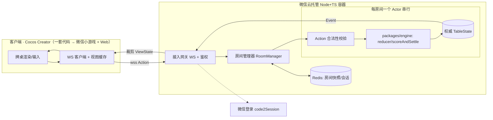
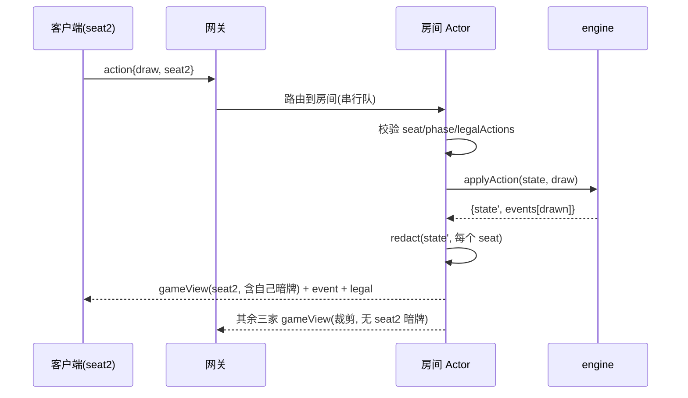

# A&C 麻将 · 联机架构方案

> **版本**：v0.1（草案）　**面向**：服务端 + 客户端联调开发
> **上游**：[PRD](../1-prd/AC麻将小游戏-PRD.md)、[台数计算规格书](./AC麻将-台数计算规格书.md)、`packages/engine`（已完成的台数 + 对局流程引擎）
> **核心思想**：**把 `packages/engine` 的 `reducer` 直接作为服务端权威状态机**——客户端只发 `Action`、只收**按座位裁剪**后的 `ViewState`，引擎代码前后端共享、服务端唯一裁决。

---

## 目录

1. [目标与范围](#1-目标与范围)
2. [架构总览](#2-架构总览)
3. [技术选型](#3-技术选型已定)
4. [服务端权威模型](#4-服务端权威模型)
5. [通信协议（WebSocket）](#5-通信协议websocket)
6. [房间服务与生命周期](#6-房间服务与生命周期)
7. [状态同步与视图裁剪](#7-状态同步与视图裁剪防透视)
8. [断线重连与托管](#8-断线重连与托管)
9. [安全与防作弊](#9-安全与防作弊)
10. [微信云托管部署](#10-微信云托管部署)
11. [数据存储](#11-数据存储)
12. [并发与可扩展性](#12-并发与可扩展性)
13. [关键时序](#13-关键时序)
14. [里程碑](#14-里程碑)
15. [风险与开放问题](#15-风险与开放问题)

---

## 1. 目标与范围

- **支撑**：房间制 4 人真人联机对战（PRD 第 4 章），服务端权威的胡牌判定/台数/结算。
- **必须**：实时同步、断线重连、超时托管、防作弊（防透视/防篡改）、微信登录鉴权。
- **跨平台复用（决策1）**：本期微信小游戏，但架构须支撑未来**独立 HTML5 版**（不依赖微信）——平台无关核心 + 平台适配层，最小化微信耦合。
- **不做**：全局匹配、跨房间持久化积分、赛季排行（PRD 非目标）。

## 2. 架构总览



**分层职责**：
- **客户端**：渲染 + 采集输入 → 发 `Action`；接收**裁剪后的 `ViewState`** 渲染，**从不持有他家暗牌**。
- **接入网关**：WSS 连接、鉴权、心跳、消息路由到房间。
- **房间 Actor**：单房间串行处理 Action（天然免锁），持有权威 `TableState`。
- **引擎**：直接复用 `packages/engine`（`applyAction`/`scoreAndSettle`），**服务端唯一算分**。
- **Redis**：房间快照（宕机恢复）、会话/路由。

## 3. 技术选型（已定）

| 层 | 选型 | 说明 |
|---|---|---|
| 客户端 | **Cocos Creator**（一套代码导出 微信小游戏 + Web/HTML5） | 跨平台复用（决策1）；渲染/输入/音频由引擎抽象 |
| 服务端 | **Node.js + TypeScript + ws** | 与引擎同语言，直接 import `@ac-majong/engine` |
| 实时 | **WebSocket** | 小游戏 **`wx.cloud.connectContainer`**（连云托管、免配域名，返回标准 socketTask） |
| 托管 | **微信云托管**（Docker 容器） | 用户已定；原生支持 WS、免运维、贴合微信生态 |
| 鉴权 | 云托管注入 `x-wx-openid`（主）+ `code2Session`（iOS 高性能+ 兜底） | openid 作身份 |
| 存储 | **Redis**（云托管配套/云数据库） | 房间快照、会话；积分房间内不持久化 |
| 共享 | `packages/engine`（pnpm workspace） | 客户端可选本地预算，服务端权威 |

> ✅ **已核实（A1 消解）**：用**云托管**作后端时**无需配置通讯域名、无需自有备案域名**——客户端用 `wx.cloud.connectContainer`（WebSocket）/ `callContainer`（HTTPS）走微信私有协议直连云托管（官方小游戏网络文档）。需**基础库 ≥ 2.21.1**。

---

## 4. 服务端权威模型

### 4.1 单一权威状态机

- 每个房间持有一份权威 `TableState`（来自 `packages/engine`）。
- 所有变更**只能**通过 `applyAction(state, action) → { state, events }` 发生；服务端是唯一写入方。
- 客户端**不运行权威逻辑**；可选跑同一引擎做**本地预算**（如听牌提示、可胡预览），但**以服务端结果为准**（PRD NFR-03）。

### 4.2 Action 两层

| 层 | Action | 处理方 |
|---|---|---|
| **房间层** | `create/join/leave/ready/start/reconnect` | RoomManager |
| **对局层** | 引擎的 `Action`：`draw/discard/respond/declareWin/kongConcealed/kongAdded` | 房间 Actor → `applyAction` |

### 4.3 一个回合的服务端处理

```
收到对局层 Action
 → 校验：发送者 seat == 当前可行动 seat？phase 匹配？Action ∈ legalActions(state, seat)？
 → 否：回 err（非法操作），不改状态
 → 是：{ state, events } = applyAction(state, action)
       → 持久化快照（异步）
       → 对每个座位生成裁剪 ViewState，分别下发
       → 必要时推进（如 advance 后自动触发下家 draw，或等客户端 draw）
```

> **合法性双重校验**：客户端 `legalActions` 置灰按钮只是 UX；服务端必须再校验一次（防篡改客户端）。

---

## 5. 通信协议（WebSocket）

### 5.1 消息封装

所有消息为 JSON，统一信封：
```jsonc
{ "t": "<类型>", "seq": 123, "room": "828666", "ts": 1699999999, "payload": { } }
```
- `seq`：客户端递增，服务端 `ack` 回带，用于去重/排序（防重放）。

### 5.2 客户端 → 服务端

| t | payload | 说明 |
|---|---|---|
| `auth` | `{ code }` | wx.login 的 code 换会话 |
| `create` | `{ maxRounds }` | 建房，返回房间号 |
| `join` | `{ room }` | 加入房间 |
| `leave` | `{}` | 离房 |
| `start` | `{}` | 房主开始（满 4 人） |
| `action` | `{ action: <引擎Action> }` | 对局动作（draw/discard/respond/…） |
| `ping` | `{}` | 心跳 |

### 5.3 服务端 → 客户端

| t | payload | 说明 |
|---|---|---|
| `authOk` | `{ session, self }` | 鉴权成功 |
| `roomView` | `{ room, seats, you, phase }` | 房间/等待页视图 |
| `gameView` | `{ ViewState }`（裁剪） | 牌桌视图（见第 7 章） |
| `event` | `{ events: GameEvent[] }` | 增量事件（动画/提示用） |
| `legal` | `{ seat, actions }` | 你当前可执行动作 |
| `ack` / `err` | `{ seq, ok, reason? }` | 确认/错误 |
| `pong` | `{}` | 心跳回 |

### 5.4 心跳与断线

- 客户端每 ~10s `ping`；服务端 ~30s 未收到 → 判定掉线（进入托管，第 8 章）。
- 重连：客户端带 `session` 重发 `auth` → 服务端恢复其座位与 `gameView`。

---

## 6. 房间服务与生命周期

### 6.1 RoomManager

- 管理房间表：`roomId → RoomActor`；分配/回收 6 位房间号。
- 创建：房主选局数上限（4/8/16/不限，D-23）→ 生成房间号 + 分享卡片。
- 加入：仅当未满 4 人且未开始（FR-房间-02）。

### 6.2 RoomActor（单房间串行）

- 持有：权威 `TableState` + `seat → connection` 映射 + 一个**串行任务队列**（同一房间的 Action 逐个处理，天然免锁、免竞态）。
- 生命周期：`waiting`（等人）→ `playing`（对局，可多局）→ `settled`（局末）→ 下一局 / `dissolved`（散场）。
- 散场：达局数上限自动 / 房主手动 → 积分清零（D-03）→ 释放房间号。

### 6.3 快照与恢复

- 每次 `applyAction` 后异步写 Redis 快照（`TableState` + 座位/会话）。
- 容器重启/宕机：RoomActor 从 Redis 快照重建，玩家重连恢复。

---

## 7. 状态同步与视图裁剪（防透视）

### 7.1 ViewState（按座位裁剪）

服务端绝不向客户端下发完整 `TableState`，而是每个座位一份裁剪后的 `ViewState`：
```jsonc
{
  "room": "828666", "round": 3, "phase": "discard",
  "dealerSeat": 0, "currentSeat": 2, "wallRemaining": 41, "lianzhuangCount": 1,
  "lastDiscard": { "seat": 1, "tile": "B5" },
  "you":  { "seat": 2, "concealed": {"W1":1,...}, "melds": [...], "flowers": ["H3"], "zi": 1, "score": 300, "legal": ["discard","kong_concealed"] },
  "others": [ { "seat": 0, "concealedCount": 13, "melds": [...], "flowersCount": 1, "zi": 1, "score": -100, "online": true, "autoPlay": false } ]
}
```
> 关键：`others` **只有暗牌张数 `concealedCount`，没有具体牌**；明副（吃/碰/杠）与花公开。彻底杜绝透视。

### 7.2 同步方式

- **全量**：进房/重连/开局 → 下发完整 `gameView`（该座位的 ViewState）。
- **增量**：平时用 `event`（GameEvent）驱动动画；关键节点（胡牌/结算/转局）再补一次全量 `gameView` 防漂移。

### 7.3 裁剪函数

`redact(state: TableState, seat: number): ViewState` —— 纯函数，与引擎同仓库（可单测：断言输出不含他家暗牌）。

---

## 8. 断线重连与托管

### 8.1 掉线检测与座位保留

- 心跳超时（~30s）或 WS 关闭 → 标记 `online=false`，**座位保留 60s**（D-24），其余三家可见「离线」。

### 8.2 重连

- 60s 内带 `session` 重连 → 恢复座位，下发全量 `gameView`（含自己暗牌），接管。

### 8.3 托管（超时自动）

- 60s 未重连 → `autoPlay=true`，服务端代打（FR-断线-03）：
  - **摸牌阶段**：自动摸；若可自摸胡且台数≥门槛 → **保守策略：不主动胡**（避免误操作），摸到则打安全牌。
  - **出牌**：打“最安全”牌（优先孤张/字牌，简单启发式）。
  - **响应阶段**：默认 `pass`（不主动吃/碰/杠/胡）。
- 托管期间玩家返回 → 立即取消 `autoPlay` 接管。

### 8.4 异常兼底

- 全员掉线/长时间无操作 → 房间快照保留一段时间（如 10 分钟）后可回收；房主掉线→房主权限临时转移或暂停开局（PRD Q3）。

---

## 9. 安全与防作弊

| 风险 | 对策 |
|---|---|
| 透视（看到他家暗牌） | **视图裁剪**：`others` 只给 `concealedCount`（第 7 章） |
| 篡改算分 | **服务端唯一算分**；客户端结果仅展示 |
| 非法操作 | 服务端 `legalActions` **双重校验**，不合法回 `err` |
| 冒用身份 | 云托管自动注入 **`x-wx-openid`**（微信私有协议、客户端无法伪造）；iOS 高性能+ 回退 `code2Session` |
| 窃听/篡改传输 | 全程 **wss**（TLS） |
| 重放攻击 | `seq` 递增 + 服务端去重；过期消息丢弃 |
| 预测牌墙 | 洗牌种子**仅服务端持有**（`shuffle(seed)`），不下发 |
| 洪水/DoS | 单连接消息频率限制；payload schema 校验 |
| 串通 | 仅好友房间制（无随机匹配）降低陌生人串通；异常牌局可日志审计 |

---

## 10. 微信云托管部署

### 10.1 容器化

- `Dockerfile`：Node **20 LTS**（非本地 v25，求稳）+ `pnpm install --frozen-lockfile` + `pnpm -r build` + 启动 WS 服务。
- monorepo 整体入镜（server 直接依赖 `@ac-majong/engine`）。

### 10.2 WebSocket 与域名（✅ 已核实，A1 消解）

- **用云托管作后端 → 无需配置通讯域名、无需自有备案域名**。客户端用 `wx.cloud.connectContainer({ config:{env}, service, path })` 建 WebSocket，返回与 `wx.connectSocket` 一致的 `socketTask`（标准 send/onMessage/onOpen/onClose）。
- 需**基础库 ≥ 2.21.1**。
- 仅当**不用云托管**（自建公网 WS）时，才需在 mp 后台配 **socket 合法域名**（wss + ICP 备案）。
- 开发期：微信开发者工具可开「不校验合法域名」临时跳过（本地联调）。
- **HTML5 版（✅ 已核实）**：云托管**公网访问默认域名** `wss://<env>.ap-shanghai.run.tcloudbase.com`（腾讯已备案，**无需自有域名**）可被浏览器 `new WebSocket(...)` **直连**。
- **一份服务端镜像、双接入**：微信端走 `connectContainer`（带 x-wx-openid）；浏览器端走公网 wss（**不带微信身份 → 需自建登录**，见 10.3）。
- ⚠️ **心跳**：网关对 >60s 无数据的连接会主动关闭 → 客户端/服务端每 ~10s 心跳（已在 5.4 设计）。

### 10.3 登录与身份（✅ 简化）

- `connectContainer`/`callContainer` 由微信**自动注入 `x-wx-openid` 等身份头**，服务端直接读 openid 作身份，**通常无需自行 code2Session**。
- ⚠️ 例外：**iOS 高性能+ 模式**下 `connectContainer` 暂不携带微信身份（读不到 x-wx-openid）→ 需回退 `wx.login` + `code2Session` 兜底。

### 10.4 扩缩容与房间路由

- **MVP：单实例**（所有 RoomActor 在一个 Node 进程，房间制并发不高）。
- **扩展**：多实例时，`room → instance` 注册表入 Redis；网关按房间路由/重定向连接，保证**同房间玩家连到同一实例**（WS 会话粘性）。

---

## 11. 数据存储

| 数据 | 存储 | 生命期 |
|---|---|---|
| 房间快照 `TableState` | Redis | 对局期间 + 散场后短暂 |
| 会话 `session→openid→seat` | Redis | 房间生命期 |
| `room→instance` 路由 | Redis | 房间生命期 |
| 积分 | 仅内存/快照 | **房间内累计、散场清零**（D-03），不持久化 |
| 对局日志（可选） | 对象存储 | 审计/复盘 |

> 无账号体系：openid 即身份；无跨房间持久化（PRD 非目标）。

---

## 12. 并发与可扩展性

- **单房间**：Actor 串行队列处理 Action → 无锁、无竞态、顺序确定。
- **多房间**：单实例多 Actor（Node 事件循环）；房间数上限受内存/CPU约束。
- **水平扩展**：按 `room` 分片到多实例（见 10.4）；Redis 作为共享注册/快照。
- **实时性**：目标操作→广播 <200ms（NFR-01）；同实例内存广播，延迟低。

---

## 13. 关键时序

### 13.1 一个回合（摸牌→广播）



### 13.2 胡牌结算

```
玩家 action{respond, win} 或 {declareWin}
 → Actor 校验 canWin → applyAction
 → engine: resolveResponses/doSelfWin → scoreAndSettle → endRound
 → events[win, roundEnd] + 各家积分变动
 → 广播 gameView(含结算明细) → 客户端展示台数/积分
 → startNextRound 或散场
```

---

## 14. 里程碑

| 阶段 | 交付 | 依赖 |
|---|---|---|
| **t4-a 服务骨架** | WS 网关 + RoomManager + 单房间 Actor + `redact` + 接入 engine；本地可多客户端联调 | ✅ engine 就绪 |
| **t4-b 鉴权与部署** | `code2Session` + session + 云托管 Docker 部署 + wss | t4-a |
| **t4-c 健壮性** | 断线重连 + 托管 + 快照恢复 + 限流 | t4-a |
| **t6 客户端** | **Cocos Creator** 牌桌（一套→微信小游戏+Web）+ Transport 对接 + 开发者工具跑通 | t4-a |

---

## 15. 风险与开放问题

| 编号 | 风险/问题 | 等级 | 备注 |
|---|---|---|---|
| A1 | ~~云托管 WSS 合法域名~~ | ✅ 已消解 | 用 `connectContainer` **免配域名、免备案**（官方文档已核实）；仅需基础库 ≥2.21.1 |
| A2 | 棋牌类版号/资质（PRD R1） | 🔴 高 | 上线前置；不阻塞内部原型 |
| A3 | 多实例时 WS 房间路由/会话粘性 | 🟡 中 | MVP 单实例可避；扩展期再处理 |
| A4 | 托管 AI 策略是否足够合理 | 🟡 中 | 先用安全牌启发式；可迭代 |
| A5 | 一炮多响轮庄 / 诈胡续局 为默认策略 | 🟡 中 | 引擎已标 TODO，待规则明确 |
| A6 | 心跳/超时参数（10s/30s/60s）需实测调优 | 🟢 低 | 可配置；云托管网关 60s 空闲断连，须 ~10s 心跳 |
| A7 | Cocos 工程引用 workspace 的 `@ac-majong/engine`（TS 包）构建支持 | 🟡 中 | 必要时预编译 dist 再引入；需验证 |

---

## 16. 跨平台复用与适配层（微信小游戏 + HTML5）

### 16.1 原则：端口-适配器（Hexagonal）

平台无关的**核心**依赖抽象接口（端口），微信/Web 的具体实现作为**适配器**；核心零微信依赖。

### 16.2 复用矩阵

| 层 | 复用度 | 说明 |
|---|---|---|
| `packages/engine`（规则/算分/流程） | **100% 共享** | 纯 TS，server + Cocos 客户端都用 |
| 通信协议（Action/Event/ViewState JSON） | **100% 共享** | 纯数据 |
| `server`（RoomActor/reducer/结算） | **100% 共享** | 平台无关；仅 auth 可插拔 |
| 客户端渲染/输入/音频 | **Cocos 抽象** | 一套代码导出 微信小游戏 + Web |
| 网络传输 | 适配 | `Transport` 接口 + `WeChatTransport`(connectContainer)/`WebTransport`(原生 WebSocket) |
| 鉴权身份 | 适配 | 微信 x-wx-openid / Web 自建登录；协议用通用 userId |
| 平台服务（分享/存储/系统信息） | 适配 | wx.* / Web API |

### 16.3 工程结构（决策2）

```
packages/engine    # 规则引擎（server + client 共享，零平台依赖）
server/            # 后端：Node+TS+ws+engine；可插拔 auth；一份镜像双接入
client/            # 一个 Cocos Creator 工程 → 构建 微信小游戏 + Web
  assets/scripts/
    net/           # Transport 接口 + WeChatTransport + WebTransport
    platform/      # 分享/存储/系统信息 适配（wx / web）
    auth/          # 身份适配（x-wx-openid / 自建登录）
    game/          # 场景/UI/对局交互，import @ac-majong/engine
```

### 16.4 关键接口（伪代码）

```ts
interface Transport {
  connect(): Promise<void>;
  send(msg: ClientMsg): void;
  onMessage(cb: (msg: ServerMsg) => void): void;
  close(): void;
}
interface IdentityProvider { login(): Promise<{ userId: string; token?: string }>; }
```

`WeChatTransport` 用 `wx.cloud.connectContainer`；`WebTransport` 用 `new WebSocket('wss://<env>.ap-shanghai.run.tcloudbase.com')`。游戏网络层只依赖 `Transport`。

> 结论：**一份引擎 + 一份服务端 + 一套 Cocos 客户端代码**，通过 Transport/Identity/Platform 三组适配器覆盖微信与 HTML5 两端，微信耦合被压到最薄的适配层。

---

> **下一步**：t4-a/t8 服务骨架——新建 `server/`（Node+TS+ws），WS 网关 + RoomManager + RoomActor + `redact` + **可插拔 auth**，复用 `@ac-majong/engine` 的 `applyAction`；本地用标准 ws 客户端联调，上线时微信走 connectContainer、HTML5 走公网 wss。之后 t6 用 Cocos 建客户端。
